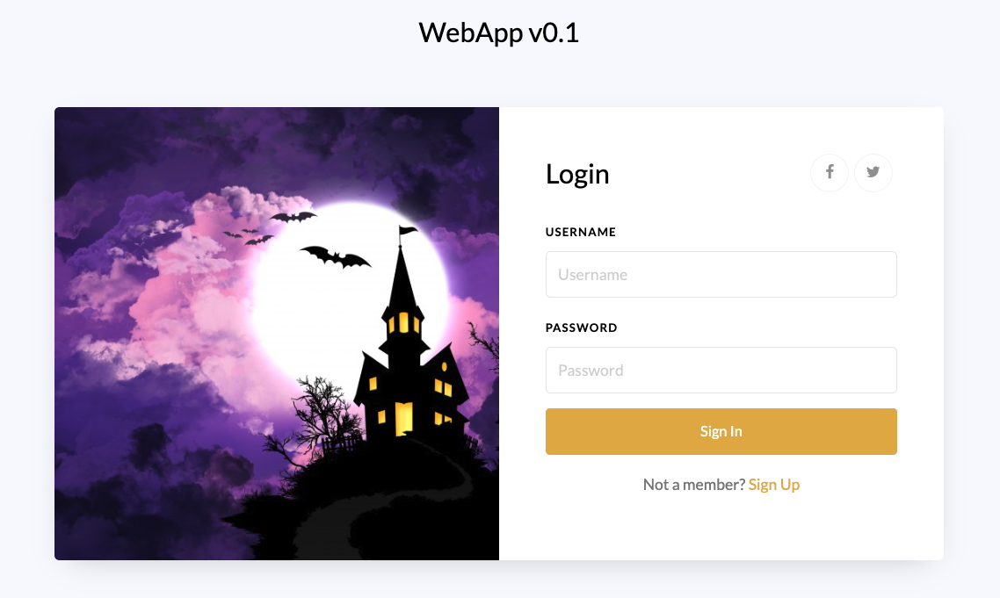
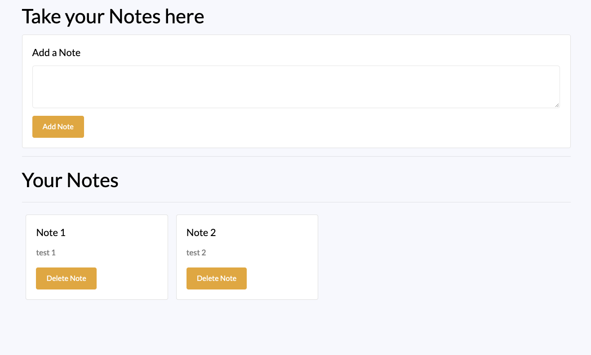
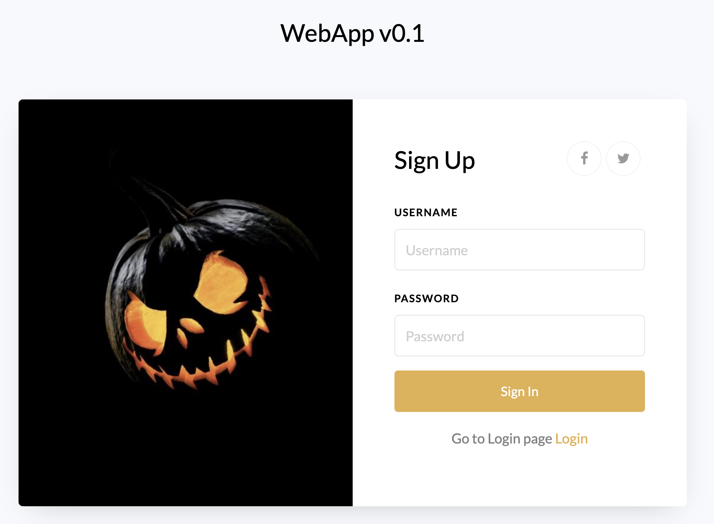

# Nodejs-login-JWT


## DB configuration

PARAMETER  | Value
------------- | -------------
DB_DATABASE  | db_test
DB_PORT  |  3306


### table 1
~~~~sql
CREATE TABLE `user` (
  `id_user` int NOT NULL AUTO_INCREMENT,
  `username` varchar(100) NOT NULL,
  `password` varchar(100) NOT NULL,
  PRIMARY KEY (`id_user`)
) ENGINE=InnoDB AUTO_INCREMENT=9 DEFAULT CHARSET=utf8mb4 COLLATE=utf8mb4_0900_ai_ci;
 ~~~~
 
### table 2
~~~~sql
CREATE TABLE `note` (
  `id_note` int NOT NULL AUTO_INCREMENT,
  `description` varchar(100) DEFAULT NULL,
  `id_user` int NOT NULL,
  PRIMARY KEY (`id_note`),
  KEY `note_FK` (`id_user`),
  CONSTRAINT `note_FK` FOREIGN KEY (`id_user`) REFERENCES `user` (`id_user`)
) ENGINE=InnoDB AUTO_INCREMENT=66 DEFAULT CHARSET=utf8mb4 COLLATE=utf8mb4_0900_ai_ci;
 ~~~~


## Run Application
```
nodemon Server 
```

## Login

## Dashboard

## Sing in


